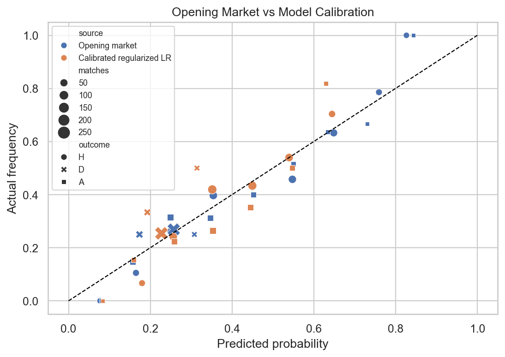

# Premier League Betting Market Efficiency Study

This project tests whether simple football models can improve on Premier League bookmaker opening odds. It is deliberately framed as a **market efficiency study**, not a profitable betting system.

The main result is nuanced: calibrated models can improve probability log loss versus the opening market, but the selected bets do **not** show convincing positive closing-line value. That is the key evidence against claiming a robust betting edge.



## Headline Result

Out-of-sample test set: **2025-2026 Premier League** from `E0 (1).csv`  
Benchmark: **Bet365 opening odds** (`B365H`, `B365D`, `B365A`)  
Closing-line check: **Bet365 closing odds** (`B365CH`, `B365CD`, `B365CA`)  
Test matches after filtering: **339**

| Model | Log loss | vs opening market | Accuracy | Brier |
| --- | ---: | ---: | ---: | ---: |
| Calibrated regularized logistic regression | 1.257 | -0.091 | 0.490 | 0.619 |
| Calibrated gradient boosting | 1.326 | -0.022 | 0.481 | 0.615 |
| Team features only | 1.332 | -0.015 | 0.442 | 0.658 |
| Elo only | 1.342 | -0.006 | 0.478 | 0.623 |
| Opening market | 1.348 | 0.000 | 0.496 | 0.610 |

The calibrated logistic model improves log loss against the opening market, but its betting output is not strong: its selected bets have negative ROI and significantly negative average CLV in the bootstrap test.

## Betting Evidence

The best short-run flat-staking ROI came from the Elo-only model, but its CLV is still negative and statistically inconclusive.

| Diagnostic | Elo-only value |
| --- | ---: |
| Bets placed | 266 |
| Flat-stake ROI | 2.36% |
| ROI bootstrap 95% CI | [-16.10%, 22.12%] |
| Average CLV | -0.72% |
| CLV bootstrap 95% CI | [-1.76%, 0.35%] |
| CLV p-value vs zero | 0.179 |

The strongest probability model does not translate into a tradable edge:

| Diagnostic | Calibrated LR value |
| --- | ---: |
| Bets placed | 287 |
| Flat-stake ROI | -3.66% |
| ROI bootstrap 95% CI | [-23.27%, 15.68%] |
| Average CLV | -1.24% |
| CLV bootstrap 95% CI | [-2.30%, -0.19%] |
| CLV p-value vs zero | 0.026 |

Interpretation: **better probabilities are not enough**. A credible betting edge should also produce positive closing-line value; this project does not find that evidence.

## Rolling Holdout Results

The notebook also repeats the exercise over multiple rolling holdout seasons rather than relying on a single split.

| Model | Holdout seasons | Avg log loss | Avg Brier | Avg ROI | Avg CLV |
| --- | ---: | ---: | ---: | ---: | ---: |
| Calibrated regularized LR | 4 | 1.256 | 0.597 | -8.66% | -1.24% |
| Calibrated gradient boosting | 4 | 1.365 | 0.585 | -3.22% | -0.22% |
| Opening market | 4 | 1.407 | 0.578 | n/a | n/a |

This is the portfolio-level conclusion: some models improve probability scoring metrics, but the risk/return and CLV diagnostics do not support a robust market-beating betting strategy.

## De-Vig Sensitivity

The notebook compares proportional overround removal with power and Shin-style de-vigging.

| De-vig method | Log loss | Accuracy | Brier |
| --- | ---: | ---: | ---: |
| Proportional | 1.348 | 0.496 | 0.610 |
| Shin-style | 1.367 | 0.496 | 0.610 |
| Power | 1.373 | 0.496 | 0.611 |

For this test set, proportional de-vig performs best on log loss, but the comparison is included because overround removal is a modelling assumption, not a neutral preprocessing step.

## Risk Metrics

Flat staking is used as the baseline, and the notebook also evaluates fractional Kelly staking, drawdown, and return volatility.

| Model | Fractional Kelly return | Max drawdown |
| --- | ---: | ---: |
| Elo only | 19.43% | -53.38% |
| Calibrated gradient boosting | -13.91% | -32.82% |
| Calibrated regularized LR | -34.63% | -63.58% |
| Team features only | -36.27% | -70.81% |

The risk metrics are intentionally uncomfortable: even apparently positive ROI models can carry deep drawdowns, and models with poor CLV should not be treated as deployable.

## What The Notebook Does

The single canonical notebook is:

```text
premier_league_market_efficiency_model.ipynb
```

It is committed with outputs so GitHub renders the full analysis without launching Jupyter.

The notebook:

1. Loads historical PremCSV files and football-data style `E0 (1).csv`.
2. Normalizes both schemas into one modelling table.
3. Builds opening-market probabilities from odds.
4. Tests market calibration and overround.
5. Creates pre-match features: rolling form, goals, xG, shots, cards, rest days, fixture congestion, promoted-team flags, and Elo ratings.
6. Compares simple and calibrated model variants against the opening market.
7. Tests proportional, power, and Shin-style de-vigging.
8. Backtests model-selected bets with flat staking and commission.
9. Measures closing-line value.
10. Bootstraps ROI and CLV confidence intervals.
11. Runs rolling holdout-season diagnostics.
12. Evaluates fractional Kelly staking, drawdown, and variance.

## Data

CSV files live in:

```text
data/PremCSV/
```

The final test file is:

```text
data/PremCSV/E0 (1).csv
```

For the 2025-2026 test season:

- Opening odds: `B365H`, `B365D`, `B365A`
- Closing odds: `B365CH`, `B365CD`, `B365CA`

## How To Run

Install dependencies:

```bash
pip install -r requirements.txt
```

Open and run:

```text
premier_league_market_efficiency_model.ipynb
```

## Requirements

- pandas
- numpy
- matplotlib
- seaborn
- scikit-learn
- jupyter

## Conclusion

This is a useful market-efficiency result precisely because it avoids overclaiming. The Premier League opening market is hard to beat. Calibrated models can improve probability scores, but the lack of positive CLV means there is no robust evidence of a tradable edge.

This is a research and portfolio project, not financial advice or a betting recommendation system.
